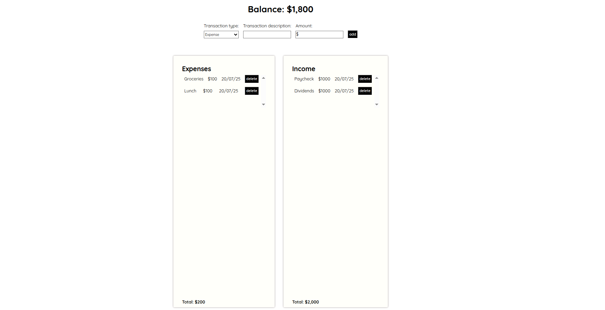

# Expense-tracker

A simple expense tracker in **vanilla JavaScript**

Data is persisted in `localStorage`, and reactivity is handled using native browser APIs and HTML templates.

The use of HTML templates provides a great alternative to innerHTML, as it is less susceptible to xss attacks!

[Live Demo](https://expense-tracker-gray-one-44.vercel.app/)
